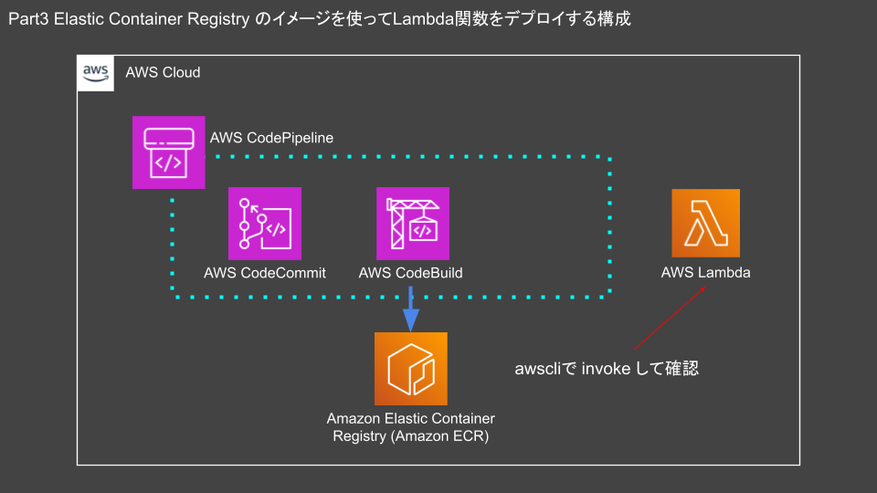

# Part3

## part3 Elastic Container Registry のイメージを使ってLambda関数をデプロイする構成

### ハンズオンの流れ

- `git clone`でハンズオンのリソースをクローンする
- ハンズオン

以下のようなインフラをAWS上に構築することを想定しています。



### リポジトリを作成する

`cicd_cloudtech`リポジトリでターミナルを開き、part3にディレクトリを変更します。

```sh
cd ~/Desktop/cicd_cloudtech/part3
```

以下のコマンドで`codecommit.yml`をCloudFormationで実行します。

```sh
aws cloudformation deploy --stack-name codecommit --template-file ./cfn/codecommit.yml --tags Name=cicdhandson --profile cicd_handson
```

### CodeCommitのリポジトリをCloneする

Desktop上にCodeCommitのリポジトリをcloneします。

```sh
cd ~/Desktop
```

```sh
git clone codecommit::ap-northeast-1://cicd_handson@cicdhandson
```

ディレクトリを移動します。

```sh
cd ~/Desktop/cicdhandson
```

### mainブランチを作成

リポジトリのメインブランチを作成します。このブランチは次に作成するブランチのマージ先になり、ビルドに利用されます。

```sh
git checkout -b main
```

テストコミットを実行します。テストコミットを実行するにはファイルを追加する必要があります。ここではREADME.mdを追加します。

```sh
echo "Hello Lambda" > README.md
```

ファイルを追加しましたら、変更をコミットしてリモートリポジトリにプッシュします。

```sh
git add .
git commit -m "part3"
git push --set-upstream origin main
```

### lambda_handsonブランチを切る

新しいブランチでビルドを実行する為にCodeBuild用に新しくブランチを切ります。

```sh
git checkout -b lambda_handson
```

### ファイルをコピーする

以下の3つのファイルをデスクトップにある`cicdhandson`にコピーします。

- buildspec.yml
  - CodeBuildで利用する設定ファイル
- dockerfile
- app.py
  - Lambdaで実行するスクリプト
  - Lambdaを実行する際には`aws lambda invoke`コマンドを利用します。

part3ディレクトリにあるbuildspec.ymlを`cicd_handson`リポジトリにコピーします。

```sh
cp ~/Desktop/cicd_cloudtech/part3/src/* ~/Desktop/cicdhandson/ && ls -la
```

### リモートリポジトリを更新する

CodeCommitのリモートリポジトリにdockerfileをpushします。
リモートリポジトリにブランチを追加します。

```sh
git add .
git commit -m "part3"
git push --set-upstream origin lambda_handson
```

### インフラを構築する

`cicd_cloudtech`リポジトリでターミナルを開き、part3にディレクトリを変更します。

```sh
cd ~/Desktop/cicd_cloudtech/part3
```

Part3用のテンプレート、`infra-part3.yml`を適用します。

```sh
aws cloudformation deploy --stack-name infra-part3 --template-file ./cfn/infra-part3.yml --tags Name=cicdhandson --capabilities CAPABILITY_NAMED_IAM --profile cicd_handson
```

### プルリクエストを作成する

環境構築は以上です。ここからは実際に動かしてみましょう。本章の構成を動作させるにためにはmainブランチの他にブランチを作成してそれをマージする必要があります。
CodeCommitはAWS CLIの実行でプルリクエストの作成とプルリクエストのマージができます。

プルリクエストの作成、プルリクエストのマージには2つの情報が必要です。

- プルリクエストID
- コミットID

リポジトリを参照するため、ディレクトリを変更します。

```sh
cd ~/Desktop/cicdhandson
```

プルリクエストをCodeCommit上に作成します。

```sh
PULL_REQUEST_ID=`aws codecommit create-pull-request --title "part3" --description "part3 lambda ci/cd 2" --targets repositoryName=cicdhandson,sourceReference=lambda_handson --profile cicd_handson --query 'pullRequest.pullRequestId' --output text` && echo $PULL_REQUEST_ID
```

コミットIDを取得します。

```sh
COMMITID=`aws codecommit get-branch --repository-name cicdhandson --branch-name lambda_handson --profile cicd_handson --query 'branch.commitId' --output text` && echo $COMMITID
```

### ブランチをマージする

最後にプルリクエストID、コミットIDの2つを利用してブランチをマージします。

```sh
aws codecommit merge-pull-request-by-fast-forward --pull-request-id $PULL_REQUEST_ID --source-commit-id $COMMITID --repository-name cicdhandson --profile cicd_handson --query 'pullRequest.pullRequestId' --output text
```

ブランチをマージしたことによってCodePipelineが動作し、イメージが自動で作成されます。イメージのビルドが時間がかかりますのでしばらく待ちましょう。
ビルドされたイメージを使ってLambda関数を作成します。

### Lambdaを関数を作成する

CloudFormationでLambdaを構築します。
以下のコマンドで`lambda.yml`をCloudFormationで実行します。

```sh
aws cloudformation deploy --stack-name lambda --template-file ./cfn/lambda.yml --tags Name=cicdhandson --capabilities CAPABILITY_NAMED_IAM --profile cicd_handson
```

以降はこのLambdaを使って関数をテストします。

### Lambda関数のテスト

AWS CLIでLambdaを実行します。Lambdaにはさまざまな実行方法がありますが、今回は`aws lambda invoke`で実行します。
以下のコマンドを実行するとLambdaの実行結果が表示され、responce.jsonには結果が記録されます。

```bash
aws lambda invoke --profile cicd_handson --function-name "cicdhandsonFunc" --invocation-type RequestResponse --region "ap-northeast-1" response.json && cat response.json
```

### 現在のLambda関数でバージョンを作成する

関数のテストが完了しましたので次は関数の中身を修正して修正した内容で実行されるかを確認します。
修正前に現在の状態でバージョンを作成します。バージョンを作成することで修正に誤りがあった場合は何かしらの理由があったときに戻せます。

まずはアカウントIDを取得します。このアカウントIDを次のコマンドで利用します。

```bash
ACCOUNT_ID=`aws sts get-caller-identity --profile cicd_handson --query 'Account' --output text`
```

現在のLambda関数でバージョンを作成するため、バージョン番号を取得します。

```bash
LAMBDA_VERSION=`aws lambda publish-version --profile cicd_handson --function-name "cicdhandsonFunc" --query 'Version' --output text` && echo $LAMBDA_VERSION
```

### 現在のバージョンでエイリアスを作成する

エイリアスを作成します。エイリアスを作成することでバージョン番号を意識することなくLambda関数を実行できます。
まずは現在のバージョンを`deploy`エイリアスに登録します。

```bash
aws lambda create-alias --profile cicd_handson --function-name "cicdhandsonFunc" --function-version $LAMBDA_VERSION --name deploy --query 'FunctionVersion' --output text
```

これでエイリアスの作成が完了しました。バージョンを意識することなく、Lambdaを実行できます。

### app.py を修正する

cloneしたリポジトリにディレクトリを変更します。

```sh
cd ~/Desktop/cicdhandson
```

ブランチを切り替えます。

```sh
git checkout lambda_handson
```

`app.py`を以下のように修正します。

```py

def lambda_handler(event, context):

    return {
        'Hello': 'Test Lambda 2'
    }

```

変更を追加して、コミットを実行します。

```sh
git add .
git commit -m "part3 alias change"
```

リモートリポジトリに変更を反映します。

```sh
git push --set-upstream origin lambda_handson
```

### プルリクエストを作成する（2回目）

ブランチをリモートリポジトリ上でマージします。1回目と同じ容量でコマンドを実行します
作成と同時にプルリクエストIDを取得します。

```sh
PULL_REQUEST_ID=`aws codecommit create-pull-request --title "part3" --description "part3 lambda ci/cd 2" --targets repositoryName=cicdhandson,sourceReference=lambda_handson --profile cicd_handson --query 'pullRequest.pullRequestId' --output text` && echo $PULL_REQUEST_ID
```

コミットIDを取得します。

```sh
COMMITID=`aws codecommit get-branch --repository-name cicdhandson --branch-name lambda_handson --profile cicd_handson --query 'branch.commitId' --output text` && echo $COMMITID
```

### ブランチをマージする（2回目）

最後にプルリクエストID、コミットIDの2つを利用してブランチをマージします。

```sh
aws codecommit merge-pull-request-by-fast-forward --pull-request-id $PULL_REQUEST_ID --source-commit-id $COMMITID --repository-name cicdhandson --profile cicd_handson --query 'pullRequest.pullRequestId' --output text
```

ブランチをマージしたことによってCodePipelineが動作し、イメージが自動で作成されます。
ビルドされたイメージを使ってLambda関数を作成します。

マージが完了するとイメージが再度ビルドされるのでしばらく待ちます。

### 新しいバージョンの関数を作成する

新しいコンテナイメージでLambdaを作成するためにバージョン番号を発行します。

```bash
LAMBDA_VERSION=`aws lambda update-function-code --profile cicd_handson --function-name "cicdhandsonFunc" --image-uri "$ACCOUNT_ID.dkr.ecr.ap-northeast-1.amazonaws.com/cicdhandson:latest" --publish --query 'Version' --output text` && echo $LAMBDA_VERSION
```

これで2つのバージョンが作成できました。

### エイリアスに新しいバージョン番号を割り当てる

次にエイリアスを変更します。この変更作業によってLambdaを新しいバージョンに切り替えられます。

```bash
aws lambda update-alias --profile cicd_handson --function-name "cicdhandsonFunc" --function-version $LAMBDA_VERSION --name deploy  --query 'FunctionVersion' --output text
```

### Lambda関数のテスト(エイリアスを変更後)

エイリアスが変更されたことを確認します。

```bash
aws lambda invoke --profile cicd_handson --function-name "cicdhandsonFunc:deploy" --invocation-type RequestResponse --region "ap-northeast-1" response.json && cat response.json
```
