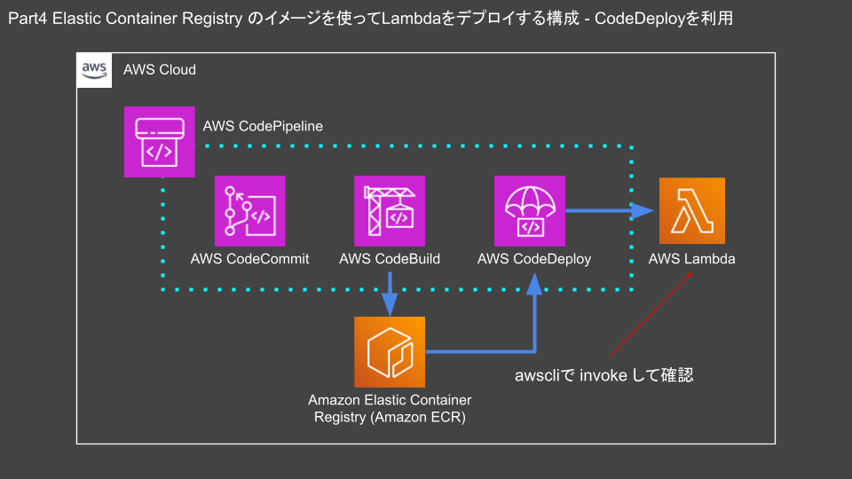
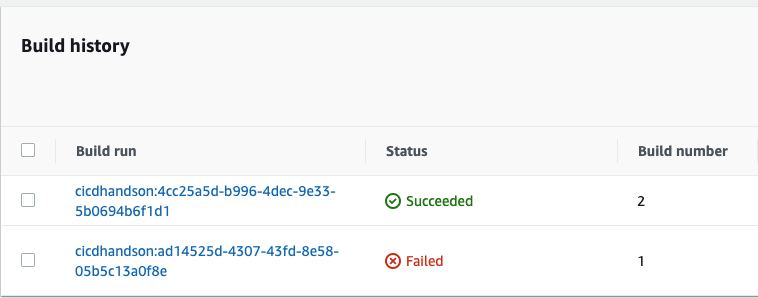
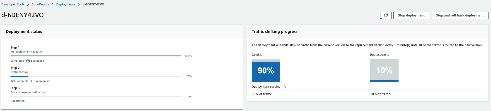

# Part4

## part4 Elastic Container Registry のイメージを使ってLambdaをデプロイする構成 - CodeDeployを利用

本章ではServerless Application Modelを使ったハンズオンを紹介します。

### このハンズオンの流れ

- `git clone`でハンズオンのリソースをダウンロードする
- ハンズオン

以下のようなインフラをAWS上に構築することを想定しています。



### リポジトリを作成する

`cicd_cloudtech`リポジトリでターミナルを開き、part4にディレクトリを変更します。

```sh
cd ~/Desktop/cicd_cloudtech/part4
```

以下のコマンドで`codecommit.yml`をCloudFormationで実行します。

```sh
aws cloudformation deploy --stack-name codecommit --template-file ./cfn/codecommit.yml --tags Name=cicdhandson --profile cicd_handson
```

### CodeCommitのリポジトリをCloneする

Desktop上にCodeCommitのリポジトリをcloneします。

```sh
cd ~/Desktop
```

```sh
git clone codecommit::ap-northeast-1://cicd_handson@cicdhandson
```

ディレクトリを移動します。

```sh
cd ~/Desktop/cicdhandson
```

### mainブランチを作成

cloneしたばかりのリポジトリにはmainブランチがありません。
ハンズオンではmainブランチをデフォルトブランチとしてアプリケーションを記録します。mainブランチを作成します。

```sh
git checkout -b main
```

実行結果

```text
Switched to a new branch 'main'
```

mainブランチを説明する`README.md`を作成します。
WindowsやGUIによるファイル作成に慣れている人からすると違和感がある方法でファイルを作成していると思いますが、CLI上でファイルを作成する方法としては一般的な方法となるので覚えておきましょう。

```sh
echo "Hello SAM" > README.md
```

最後にリポジトリにファイルをpushします。
`git add`で変更をステージに移行、commitで変更を反映したら、pushでCodeCommit上のリモートブランチを更新します。

```sh
git add .
git commit -m "part4"
git push --set-upstream origin main
```

### sam_handsonブランチを切る

新しいブランチでビルドを実行する為にCodeBuild用に新しくブランチを切ります。
ハンズオンではmainブランチをビルド対象としています。その為、mainブランチを変更するのではなくmainブランチをソースに別のブランチを作成します。
作成したブランチで変更を管理します。

```sh
git checkout -b sam_handson
```

### ファイルをコピーする

以下の`buildspec.yml`をデスクトップにある`cicdhandson`にコピーします。

- buildspec.yml
  - CodeBuildで利用する設定ファイル

part4ディレクトリにあるbuildspec.ymlを`cicd_handson`リポジトリにコピーします。

```sh
cp ~/Desktop/cicd_cloudtech/part4/src/buildspec.yml ~/Desktop/cicdhandson/ && ls -la
```

### SAMのパッケージをコピーする

今回はAWSの公式ドキュメントに記載されている`SAM-Tutorial`をCodeBuildで実行します。
ソースコードをCodeCommitリポジトリにコピーします。

```sh
cp ~/Desktop/cicd_cloudtech/part4/src/SAM-Tutorial/* ~/Desktop/cicdhandson/ && ls -la
```

### リモートリポジトリを更新する

CodeCommitのリモートリポジトリにdockerfileをpushします。
リモートリポジトリにブランチを追加します。
補足となりますが、リモートブランチを追加する時は`--set-upstream`をつけることでブランチを追加できます。

```sh
git add .
git commit -m "part4"
git push --set-upstream origin sam_handson
```

### インフラを構築する

`cicd_cloudtech`リポジトリでターミナルを開き、part4にディレクトリを変更します。

```sh
cd ~/Desktop/cicd_cloudtech/part4
```

Part4用のテンプレート、`infra-part4.yml`を適用します。

```sh
aws cloudformation deploy --stack-name infra-part4 --template-file ./cfn/infra-part4.yml --tags Name=cicdhandson --capabilities CAPABILITY_NAMED_IAM --profile cicd_handson
```

### プルリクエストを作成する

環境構築は以上です。ここからは実際に動かしてみましょう。
変更をmainブランチにマージするためにCodeCommit上でプルリクエストを作成します。

```sh
PULL_REQUEST_ID=`aws codecommit create-pull-request --title "part4" --description "part4 lambda ci/cd" --targets repositoryName=cicdhandson,sourceReference=sam_handson --profile cicd_handson --query 'pullRequest.pullRequestId' --output text` && echo $PULL_REQUEST_ID
```

コミットIDを取得します。

```sh
COMMITID=`aws codecommit get-branch --repository-name cicdhandson --branch-name sam_handson --profile cicd_handson --query 'branch.commitId' --output text` && echo $COMMITID
```

### ブランチをマージする

PULL_REQUEST_IDとCOMMITIDを元にブランチをマージします。
マージするとCodePipelineが動作します。AWSマネジメントコンソールを参照するとPipelineの動作を確認できます。
[リンク](https://ap-northeast-1.console.aws.amazon.com/codesuite/codepipeline/pipelines)

```sh
aws codecommit merge-pull-request-by-fast-forward --pull-request-id $PULL_REQUEST_ID --source-commit-id $COMMITID --repository-name cicdhandson --profile cicd_handson --query 'pullRequest.pullRequestId' --output text
```

およそ3分程度でデプロイが完了します。CodeBuildのBuild historyに`Succeeded`と表示されていれば、問題ありません。


### CodeDeployでアプリケーションをデプロイ

ここまででAWSにアプリケーションをデプロイできました。初回のデプロイではCodeDeployがどのようにデプロイするのかを確認できません。
CodeDeployの動作を確認するためにはもう一度デプロイ動作を繰り返す必要があります。

ソースコードやREADMEを修正するかリポジトリにファイルを追加します。追加したことをトリガーにデプロイを再実行します。

新しくターミナルを開いて、`cicdhandson`リポジトリにディレクトリを変更します。

```sh
cd ~/Desktop/cicdhandson
```

利用するブランチを変更します。

```sh
git checkout sam_handson
```

README.mdを以下のコマンドで更新します。

```sh
echo "# Hello CodeDeploy" > README.md
```

リモートリポジトリを更新します。

```sh
git add .
git commit -m "codedeploy"
git push -u 
```

### プルリクエストを作成する(2回目)

変更をmainブランチにマージするためにCodeCommit上でプルリクエストを作成します。

```sh
PULL_REQUEST_ID=`aws codecommit create-pull-request --title "CodeDeploy" --description "codedeploy deploy" --targets repositoryName=cicdhandson,sourceReference=sam_handson --profile cicd_handson --query 'pullRequest.pullRequestId' --output text` && echo $PULL_REQUEST_ID
```

```sh
COMMITID=`aws codecommit get-branch --repository-name cicdhandson --branch-name sam_handson --profile cicd_handson --query 'branch.commitId' --output text` && echo $COMMITID
```

### ブランチをマージする(2回目)

PULL_REQUEST_IDとCOMMITIDを元にブランチをマージします。
マージするとCodePipelineが動作します。AWSマネジメントコンソールを参照するとPipelineの動作を確認できます。
[リンク](https://ap-northeast-1.console.aws.amazon.com/codesuite/codepipeline/pipelines)

```sh
aws codecommit merge-pull-request-by-fast-forward --pull-request-id $PULL_REQUEST_ID --source-commit-id $COMMITID --repository-name cicdhandson --profile cicd_handson --query 'pullRequest.pullRequestId' --output text
```

### CodeDeployで動作を見る

CodePipelineが動作している際にCodeDeployの画面を開くとアプリケーションへのトラフィックが徐々に移行していることがわかります。
[CodeDeployのリンク](https://ap-northeast-1.console.aws.amazon.com/codesuite/codedeploy/deployments)を開き、`my-date-time-app-ServerlessDeploymentApplication-XXXX`と表示されている項目にチェックを入れ、`View details`をクリックします。

※トラフィックが徐々に移行していることがわかる画面

