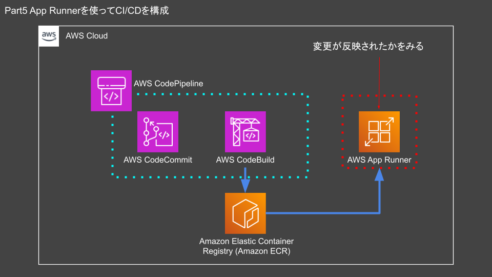

# Part5

## part5 App Runnerを使ってCI/CDを構成

### このハンズオンの流れ

- `git clone`でハンズオンのリソースをダウンロードする
- ハンズオン

以下のようなインフラをAWS上に構築することを想定しています。



### リポジトリを作成する

`cicd_cloudtech`リポジトリでターミナルを開き、part5にディレクトリを変更します。

```sh
cd ~/Desktop/cicd_cloudtech/part5
```

以下のコマンドで`codecommit.yml`をCloudFormationで実行します。

```sh
aws cloudformation deploy --stack-name codecommit --template-file ./cfn/codecommit.yml --tags Name=cicdhandson --profile cicd_handson
```

### CodeCommitのリポジトリをクローンする

Desktop上に作成したCodeCommitのリポジトリをcloneします。

```sh
cd ~/Desktop
```

```sh
git clone codecommit::ap-northeast-1://cicd_handson@cicdhandson
```

ディレクトリを移動します。

```sh
cd ~/Desktop/cicdhandson
```

### mainブランチを作成

cloneしたばかりのリポジトリにはmainブランチがありません。
ハンズオンではmainブランチをデフォルトブランチとしてアプリケーションを記録します。mainブランチを作成します。

```sh
git checkout -b main
```

テストコミットを実行します。テストコミットを実行するにはファイルを追加する必要があります。ここではREADME.mdを追加します。

```sh
echo "Hello Lambda" > README.md
```

ファイルを追加しましたら、変更をコミットしてリモートリポジトリにプッシュします。

```sh
git add .
git commit -m "part5"
git push --set-upstream origin main
```

### app_runer_handsonブランチを切る

新しいブランチでビルドを実行するためにCodeBuild用に新しくブランチを切ります。

```sh
git checkout -b app_runer_handson
```

### buildspec.yamlをコピーする

CodeBuildで利用する設定ファイル（buildspec.yml）を作成します。
part5ディレクトリにあるbuildspec.ymlを`cicd_handson`リポジトリにコピーします。

```sh
cp ~/Desktop/cicd_cloudtech/part5/src/buildspec.yml ~/Desktop/cicdhandson/
```

### dockerfileをコピーする

dockerfileを追加します。
`aws_code_happy`リポジトリに戻り、part5ディレクトリにあるdockerfileを`cicd_handson`リポジトリにコピーします。

```sh
cp ~/Desktop/cicd_cloudtech/part5/src/dockerfile ~/Desktop/cicdhandson/
```

### リモートリポジトリを更新する

CodeCommitのリモートリポジトリにdockerfileをpushします。
リモートリポジトリにブランチを追加します。

```sh
git add .
git commit -m "part5"
git push --set-upstream origin app_runer_handson
```

### インフラを構築する

`cicd_cloudtech`リポジトリでターミナルを開き、part5にディレクトリを変更します。

```sh
cd ~/Desktop/cicd_cloudtech/part5
```

part5用のテンプレート、`infra-part5.yml`を適用します。

```sh
aws cloudformation deploy --stack-name infra-part5 --template-file ./cfn/infra-part5.yml --tags Name=cicdhandson --capabilities CAPABILITY_NAMED_IAM --profile cicd_handson
```

### プルリクエストを作成する

環境構築は以上です。ここからは実際に動かしてみましょう。本章の構成を動作させるにためにはmainブランチの他にブランチを作成してそれをマージする必要があります。 CodeCommitはAWS CLIの実行でプルリクエストの作成とプルリクエストのマージができます。

プルリクエストの作成、プルリクエストのマージには2つの情報が必要です。

- プルリクエストID
- コミットID

まずはプルリクエストをCodeCommit上に作成します。

```sh
PULL_REQUEST_ID=`aws codecommit create-pull-request --title "part5" --description "part5 App Runner ci/cd" --targets repositoryName=cicdhandson,sourceReference=app_runer_handson --profile cicd_handson --query 'pullRequest.pullRequestId' --output text` && echo $PULL_REQUEST_ID
```

コミットIDを取得します。

```sh
COMMITID=`aws codecommit get-branch --repository-name cicdhandson --branch-name app_runer_handson --profile cicd_handson --query 'branch.commitId' --output text` && echo $COMMITID
```

### ブランチをマージする

最後にプルリクエストID、コミットIDの2つを利用してブランチをマージします。

```sh
aws codecommit merge-pull-request-by-fast-forward --pull-request-id $PULL_REQUEST_ID --source-commit-id $COMMITID --repository-name cicdhandson --profile cicd_handson --query 'pullRequest.pullRequestId' --output text
```

### ビルドされたイメージを確認する

ビルドされたイメージのイメージダイジェストを確認します。
イメージダイジェストとはそのイメージを示すSHA256でエンコードされた文字列です。

```sh
aws ecr list-images --profile cicd_handson --repository-name cicdhandson --query "imageIds[*].imageDigest" --output table
```

今回はこの文字列がdockerfileに記載の文字列と一致します。

```text
-----------------------------------------------------------------------------
|                                ListImages                                 |
+---------------------------------------------------------------------------+
|  sha256:70f9eda4317cdce66c06fe1a699cae9bb1627cac91e1c9c6a09f6b3572fd56b4  |
+---------------------------------------------------------------------------+
```

イメージダイジェストが表示されない場合はまだビルドされていない可能性があるため、ビルドされるまでしばらく待ちましょう。

### App Runnerにコンテナをデプロイする

イメージをビルドした後はApp Runnerでアプリケーションをデプロイします。デプロイにはCloudFormationを利用します。

```sh
aws cloudformation deploy --stack-name apprunner --template-file ./cfn/app_runner.yml --tags Name=cicdhandson --capabilities CAPABILITY_NAMED_IAM --profile cicd_handson
```

### 動作確認
